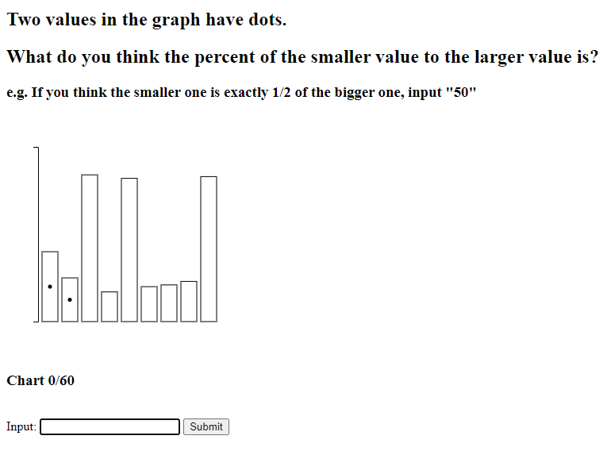
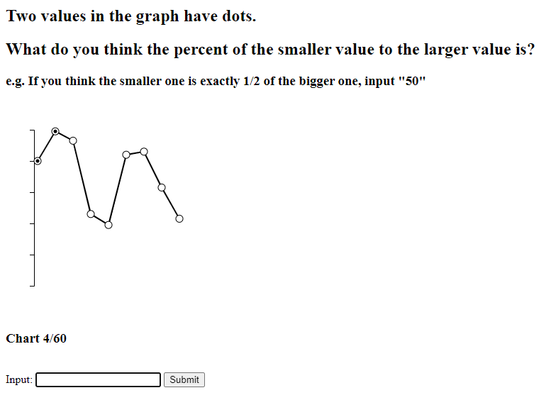
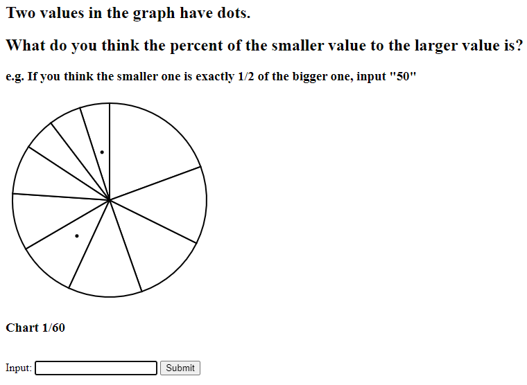
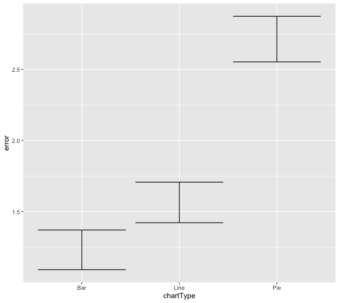
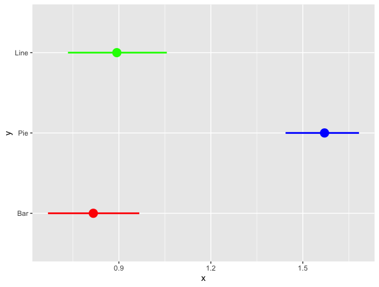

Experiment Information
===

Link to website, hosted on glitch: https://a3experiment.glitch.me/

This application used d3.js and html in the front-end and node.js, express.js, and mongoose in the back-end. We utilized html to create the survey and transition between different graphs that were made using d3. During the survey, the plots were each marked with 2 dots, signifying which parts of the chart we wanted to compare. The data was collected during the survey and sent to the server when the survey was submitted. After the data was sent to the server using a POST request, we parsed the data and put it in a mongoDB server. Then, we used mongoDB tools to convert it into a csv file so as to analyze the results using both the bootstrapped log2 error distribution used by Cleveland and McGill and a graph with normal error. 

Experiment Results In Order of Performance
===

Bar
---

Our bar chart was our best performing chart. This is similar to Cleveland & McGill's results, as it is easier to compare two bars' height as opposed to other visualizations.

Line
---

Our line chart was worse in performance compared to the bar chart, but beat out the pie chart by a significant margin. This is reasonable, as similarly to the bar chart, the line chart compares the data vertically. 

Pie
---

Box plots were the worst performing chart out of the three. This could be for a couple reasons, the first theory being the lack of knowledge about how to read a slice of a circle.  Secondly, pie charts could overall be harder to compare sizes due to the lack of alignment between each slice. (The slices weren't always next to each other, creating a different visual effect.) This caused for a wide variability in answers, creating more outliers than the other two charts. Thirdly, as a slice of the chart can be oriented differently, it creates very different visual effects causing the subject to become confused to the true size of the shape. 

Results in detailed graphs
===

error graph
---

Our bar chart results are very similar to the Cleveland and McGill results, as you can see. Our pie chart results, on the other hand, were marginally poorer than Cleveland and McGill, with a greater spread. According to their technique, they labeled their slices with letters at the halfway of each slice, and their slices were all rather large. In contrast, in our study we only reduced the size of our pie chart segments when they were nearly unnoticeable. These characteristics could have improved graphical perception.

bootstrapped log2 error distribution
---

__Log-base-2 or "cm-error"__: The true percent is the actual percentage of the smaller to the larger, while the reported percent is what participants reported. 
Cleveland and McGill recognized that their analyses would be biased if they took `abs(ReportedPercent – TruePercent)` as their score for error. 
To compensate, they came up with a logarithmic scale for error with this equation:

## Technical Achievements
- **Server**: Used Node.JS server with express.JS framework.

- **Database**: Used MongoDB and mongoose to send data to a mongoDB database.

- **Database Tools**: First time using MongoDB tools. Learned how to generate CSV file with selective data fields using the tools. This had to be downloaded separately and set as a root path so it could be used in my terminal.

- **dotenv**: Used to protect sensitive data information, such as admin username and password.

- **body-parser**: Used bodyparser to easily parse JSON data being passed from the client to the server.

### Design Achievements
- We added a counter to tell participants how many questions they had completed and how many were remaining
- When creating the chart, we kept in mind the need for consistency between different charts, thus, we have a consistent chart design and sizing.
- Explored how different color can affect graphs but later returned to comparison with dots. 
- We added our to dots to the middle of the graphs; while this differs from Cleveland and McGill's example, it provided a clearer comparison and improved the users' graphical perception of the object. 
